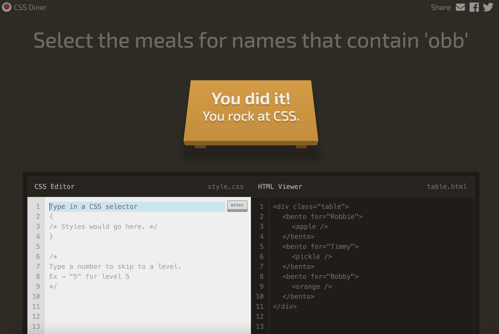

# Comandos **Css**

1. Select the plates
- [x]  plate 
  

2. Select the bento boxes
- [x] bento

3. Select the fancy plate
- [x] #fancy

4. Select the apple on the plate
- [x] plate apple

5. Select the pickle on the fancy plate
- [x] #fancy pickle

6. Select the small apples
- [x] .small

7. Select the small oranges
- [x] orange.small

8. Select the small oranges in the bentos
- [x] bento orange.

9. Select all the plates and bentos
- [x] plate, bento

10. Select all the things!
- [x] *

11. Select everything on a plate
- [x] plate * 

12. Select every apple that's next to a plate
- [x] plate + apple

13. Select the pickles beside the bento
- [x] bento ~ pickle

14. Select the apple directly on a plate
- [x] plate > apple

15. Select the top orange
- [x] orange:first-child

16. Select the apple and the pickle on the plates

- [x] plate>apple plate>pickle

17. Select the small apple and the pickle
    
- [x] .small:last-child 

18. Select the 3rd plate
- [x]  :nth-child(3)

19. Select the 1st bento
- [x] bento:nth-last-child(3)

20. Select first apple
- [x]  apple:first-of-type

21. Select all even plates
- [x] :nth-of-type(even)
22. Select every 2nd plate, starting from the 3rd

- [x] :nth-of-type(2n+3)

23. Select the apple on the middle plate
- [x]  apple:only-of-type

24. Select the last apple and orange
    
- [x]  .small:last-of-type 

25. Select the empty bentos
- [x] bento:empty

26. Select the big apples
- [x] apple:not(.small) 

27. Select the items for someone
- [x] [for]
  

28. Select the plates for someone
- [x] plate[for]
  

29. Select Vitaly's meal
- [x] [for='Vitaly']

30. Select the items for names that start with 'Sa'
- [x] [for^='S']

31. Select the items for names that end with 'ato'
- [x]  [for$='ato']

32. Select the meals for names that contain 'obb'
- [x] [for*='obb']

## Finalizacion de ejercicios :zap: 
 

